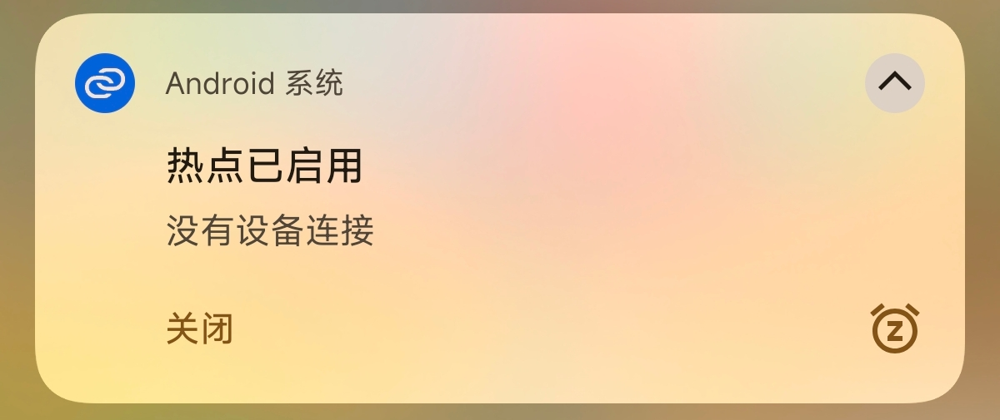
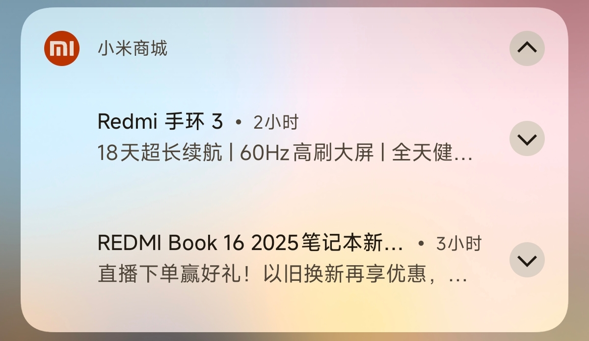
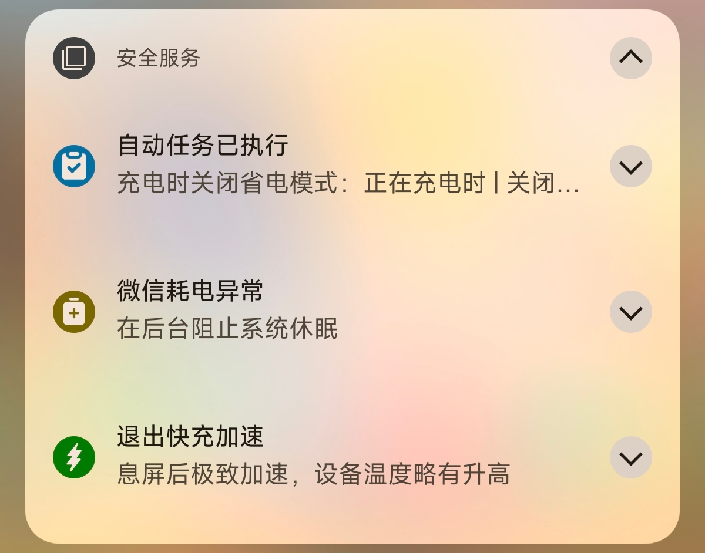
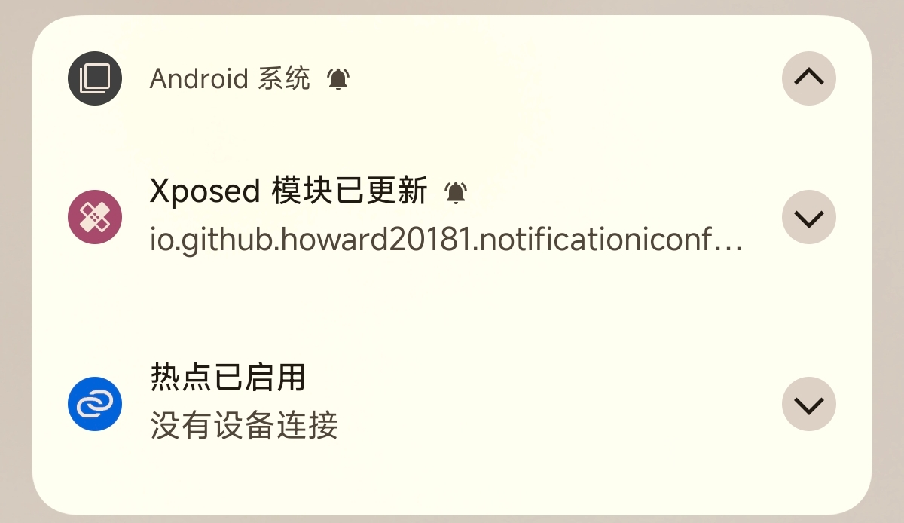

# Notification Icon Fix

[中文](README.zh.md)

A module for AOSP, MIUI and HyperOS. Using an algorithm to convert white notification icons into recognizable icons.

## Supported System

- Android 8.1 ~ AOSP main branch
- HyperOS
- MIUI 12.5

## Screenshots

|||
|---|---|
|||
|||

## Algorithm Details

1. Determine and reduce oversized icons to the maximum allowed icon size
2. Map the icon pixel position to a two-dimensional coordinate system and calculate the geometric center
3. (For MIUI) Detect transparent borders and trim icons
4. (For MIUI and HyperOS) Determine if the icon has a marketing banner and replace it with a [perfect icon](https://github.com/pzcn/Perfect-Icons-Completion-Project) (Need to install it yourself)
5. (For HyperOS) Determine if the icon is a weather icon, and replace it with a MAML icon with real-time temperature (there is a race on HyperOS, which shows that the temperature area is blank, which is a system bug)
6. Calculate the average lumens excluding transparent pixels
7. Quantify the most common color of edge pixels
8. Calculate the Euclidean distance between the color of the edge pixel and the most common color obtained above in Lab color space to determine whether the icon has a border
9. Determine whether the icon background is light or dark
10. Use K-means quantizer to extract the primary color of the icon
11. Invert the icon foreground according to the background and remove the border
12. Determine the actual visible area of ​​the icon and remove the blank area based on the visual center
13. Final result output, cache icon, and accent color to WeakHashMap
